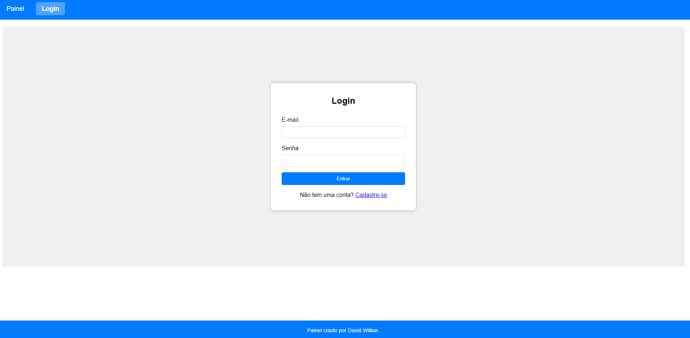

# Desafio: Desenvolvimento de Painel de Vacinação COVID-19

## Descrição

Este projeto consiste em desenvolver uma aplicação de painel de vacinação COVID-19. O painel deve apresentar gráficos baseados nos dados do [DataSet do Kaggle](https://www.kaggle.com/gpreda/covid-world-vaccination-progress). 

## Tecnologias e Ferramentas

- **Front-end:** Angular
- **Back-end:** Spring Boot e Java 
- **Banco de Dados:** PostgreSQL
- **Biblioteca de Gráficos:** Plotly (https://plotly.com/javascript/)
- **Autenticação:** Tokens JWT
- **Documentação da API:** Swagger (https://swagger.io)

## Requisitos

### Back-end

1. **Banco de Dados:** 
   - Carregar o dataset do Kaggle em uma base de dados PostgreSQL.

2. **Endpoints REST:**
   - Implementar endpoints que forneçam os dados para os gráficos.
   - Usar tokens JWT para autenticação.
   - Documentar a API com Swagger ou OpenAPI.

3. **Operação Administrativa:**
   - Criar uma área autenticada via login e senha para carregar o CSV do Kaggle e atualizar o dataset.

### Front-end

1. **Painel de Vacinação:**
   - Desenvolver uma interface de usuário utilizando Angular 11.
   - Utilizar a biblioteca Plotly para apresentar gráficos.

### Rodando o Projeto

Para executar o projeto, siga as etapas abaixo:

1. **Navegar até a pasta do projeto:**
   - Abra o terminal e navegue até a pasta onde está localizado o código do projeto `covid-dashboard`. Por exemplo:
     ```bash
     cd covid-dashboard
     ```

2. **Back-end:**
   - Primeiro, crie a imagem Docker do back-end com o comando:
     ```bash
     docker build -t covid-dashboard:latest .
     ```
   - Em seguida, inicie os serviços necessários usando Docker Compose. Isso irá criar um contêiner para o back-end:
     ```bash
     docker-compose up
     ```

Certifique-se de ter o Docker em sua máquina antes de executar esses comandos. Após iniciar os serviços, o back-end estará disponível.


3. **Front-end:**
   - Navegue até a pasta onde está localizado o código do front-end, que está dentro da pasta `dashboard-app`:
     ```bash
     cd dashboard-app
     ```
   - Instale as dependências do Angular com o comando:
     ```bash
     npm install
     ```
   - Inicie o servidor de desenvolvimento do Angular com:
     ```bash
     ng serve
     ```

   O servidor de desenvolvimento do Angular iniciará e você poderá acessar a aplicação no navegador através de `http://localhost:4200` por padrão.

Certifique-se de ter o Node e o Angular CLI instalados e configurados em sua máquina antes de executar esses comandos. Após iniciar o front-end e o back-end, você terá o projeto completo em funcionamento.

### Prints do Projeto

Para visualizar como o projeto se apresenta, confira os prints abaixo:

1. **Swagger:**
   - O Swagger UI fornece uma interface interativa para explorar e testar a API. O print abaixo mostra o Swagger UI.
   
   

2. **Painel:**
   - Home do painel.
   

3. **Gráficos:**
   - Gráfico do total de vacinações por país.
   
   - Gráfico das vacinações diárias por país.
   
   - Gráfico do total de vacinações por 100 pessoas em cada país.
   

4. **Admin:**
   - Página para atualizar o dataset e adicionar novos admins.
   

5. **Autenticação:**
   - Página para realizar o login.
   
   - Página para realizar o cadastro de usuário.
   

## Licença

Este projeto está licenciado sob a [Licença MIT](LICENSE)